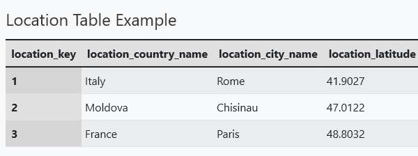
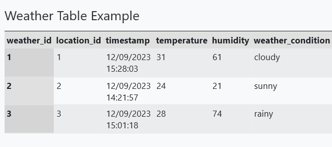
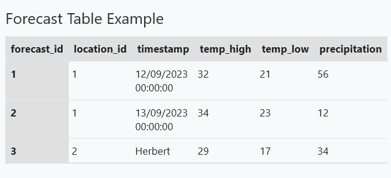

# Weather Data Microservice

## Application Suitability

The implementation of a weather data application through a microservice is necessary because it is important for the average user to get the weather data of a particular location in a fast way. A single instanced application at some point will not be able to handle a large amount of requests and will provide slower responses to the user. Another reason is the application in terms of features cand be broken down into different services where they can be maintained and updated separately. This will allow the application to be more scalable and flexible.

With the application being broken down into multiple services and maintaned separately, this will increase availability. In case of a failure in one of the services, the other service will still be available to the user.

There are multiple weather applications that use microservices. One example is OpenWeatherMap which provides to the user: weather data for any location on the globe, weather map and forecasts. It also has features where customers can get access through APIs to historical weather data, weather maps, road risk data, solar panel energy prediction data and many more.

## Service Boundaries


The application will be broken down into 2 main services: weather data and natural disaster data. The weather data service will be responsible for getting the weather data for a particular location. Weather Data service will also call the Natural Disaster Service to get the information about active alerts of natural disaster (For example tornado or flood warnings). The natural disaster data service will be responsible for getting the natural disaster data for a particular location.

## Technology Stack and Communication Patterns

Both services will be written in Go. The communication between the services will be done through REST APIs. The communication between the services and the database will be done through SQL queries. The gateway will be written in Python and will be responsible for routing the requests to the appropriate service.

## Data Management

As there are 2 main services in the application (weather data and natural disaster data), there will be 2 databases. The weather data and the natural disaster data will be stored in a relational database.

The database of the weather data will have the following tables:

- `location_table` - stores the list of the locations



- `current_weather_table` - stores the current weather data for each location



- `forecast_weather_table` - stores the forecast weather data for each location



The database of the natural disaster data will have the following tables:

- `location_table` - stores the list of the locations which will be a copy of the location table from the weather data database
- `disaster_type_table` - stores the list of the disaster types


- `disaster_list_table` - stores the disaster data for each location


### Weather Data Service

* `GET /weather/current?location={location}` - returns the current weather data for the specified location

Response:

```json
{
    "country": "Moldova",
    "location": "Chisinau",
    "timestamp": "2023-09-12T14:21:57",
    "temperature": 24,
    "humidity": 21,
    "weather_condition": "Sunny"
}
```

* `GET /weather/forecast?location={location}` - returns the forecast weather data for the specified location

Response:

```json
{
    "country": "Moldova",
    "location": "Chisinau",
    "forecast_date": "2023-09-12",
    "temperature_high": 29,
    "temperature_low": 17,
    "humidity": 34,
}
```

* `GET /weather/locations?country={country}` - returns the list of locations for the specified country

Response:

```json
{
    "country": "Moldova",
    "locations": [
        "Chisinau",
        "Balti",
        "Cahul"
    ]
}
```

* `POST /weather/add_data?type={type}` - adds the weather data to the database

Request to add current weather data `type=weather`:

```json
{
    "location_id": 1,
    "timestamp": "2023-09-12T17:00:00",
    "temperature": 24,
    "humidity": 21,
    "weather_condition": "Sunny"
}
```

Response if `location_id` exists:

```json
{
    "message": "Weather data added successfully"
}
```

Response if `location_id` does not exist:

```json
{
    "message": "Location does not exist"
}
```

Request to add forecast data `type=forecast`:

```json
{
    "location_id": 1,
    "forecast_date": "2023-09-12",
    "temperature_high": 29,
    "temperature_low": 17,
    "humidity": 34,
}
```

Response if `location_id` exists:

```json
{
    "message": "Forecast data added successfully"
}
```

Response if `location_id` does not exist:

```json
{
    "message": "Location does not exist"
}
```

* `DELETE /weather/delete_data?type={type}` - deletes the weather data from the database

Request to delete current weather data `type=weather`:

```json
{
    "location_id": 1,
    "timestamp": "2023-09-12T17:00:00"
}
```

Response if `location_id` exists:

```json
{
    "message": "Weather data deleted successfully"
}
```

Response if `location_id` does not exist:

```json
{
    "message": "Location does not exist"
}
```

Response if `timestamp` does not exist:

```json
{
    "message": "Weather data does not exist"
}
```

Request to delete forecast data `type=forecast`:

```json
{
    "location_id": 1,
    "forecast_date": "2023-09-12"
}
```

Response if `location_id` exists:

```json
{
    "message": "Forecast data deleted successfully"
}
```

Response if `location_id` does not exist:

```json
{
    "message": "Location does not exist"
}
```

Response if `forecast_date` does not exist:

```json
{
    "message": "Forecast data does not exist"
}
```

### Natural Disaster Data Service

* `GET /disasters` - returns the list of the natural disasters

Response:

```json
{
    "disasters": [
        {
            "disaster_name": "Tornado",
            "disaster_description": "Bla bla bla",
        },
        {
            "disaster_name": "Flood",
            "disaster_description": "Bla bla bla",
        },
        {
            "disaster_name": "Earthquake",
            "disaster_description": "Bla bla bla",
        }
    ]
}
```

* `GET /disasters/list?location={location}&active={active}` - returns the list of the natural disasters for the specified city

Response if `location` exists and `active=false`:

```json
{
    "country": "Moldova",
    "location": "Chisinau",
    "disaster_alerts": [
        {
            "alert_name": "Earthquake",
            "alert_description": "An earthquake with magnitude 5.0 occurred 10km from Chisinau, Moldova at 11:57:23 GMT on 2023-09-12",
            "start_time": "2023-09-12T12:00:00",
            "end_time": "2023-09-12T15:00:00"
        },
        {
            "alert_name": "Earthquake",
            "alert_description": "An earthquake with magnitude 3.5 occurred 10km from Chisinau, Moldova at 05:43:32 GMT on 2023-08-27",
            "start_time": "2023-08-27T05:45:00",
            "end_time": "2023-08-27T09:00:00"
        }
    ]
}
```

Response if `location` exists and `active=true`:

```json
{
    "country": "Moldova",
    "location": "Chisinau",
    "disaster_alerts": [
        {
            "alert_name": "Earthquake",
            "alert_description": "An earthquake with magnitude 5.0 occurred 10km from Chisinau, Moldova at 11:57:23 GMT on 2023-09-12",
            "start_time": "2023-09-12T12:00:00",
            "end_time": "2023-09-12T15:00:00"
        }
    ]
}
```

Response if `location` does not exist:

```json
{
    "message": "Location does not exist"
}
```

* `POST /disasters/alert?location={location}` - adds the natural disaster alert to the database

Request:

```json
{
    "disaster_id": 1,
    "alert_description": "An earthquake with magnitude 5.0 occurred 10km from Chisinau, Moldova at 11:57:23 GMT on 2023-09-12",
    "start_time": "2023-09-12T12:00:00",
    "end_time": "2023-09-12T15:00:00"
}
```

Response if `location` exists:

```json
{
    "message": "Disaster alert added successfully"
}
```

Response if `location` does not exist:

```json
{
    "message": "Location does not exist"
}
```

* `PUT /disasters/alert/{alert_id}` - updates the natural disaster alert in the database

Request:

```json
{
    "disaster_id": 1,
    "alert_description": "An earthquake with magnitude 7.0 occurred 10km from Chisinau, Moldova at 11:57:23 GMT on 2023-09-12",
    "start_time": "2023-09-12T12:00:00",
    "end_time": "2023-09-12T15:00:00"
}
```

Response if `alert_id` exists:

```json
{
    "message": "Disaster alert updated successfully"
}
```

Response if `alert_id` does not exist:

```json
{
    "message": "Disaster alert does not exist"
}
```

* `DELETE /disasters/alert/{alert_id}` - deletes the natural disaster alert from the database

Response if `alert_id` exists:

```json
{
    "message": "Disaster alert deleted successfully"
}
```

Response if `alert_id` does not exist:

```json
{
    "message": "Disaster alert does not exist"
}
```

## Deployment and Scaling

Each service will be deployed in a separate container where they will have a dockerfile with the necessary instructions to build the image. Docker compose will be used to deploy the application where it will create the containers and the network between them.
