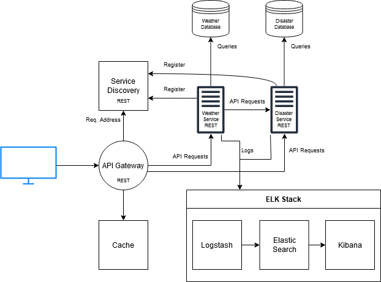
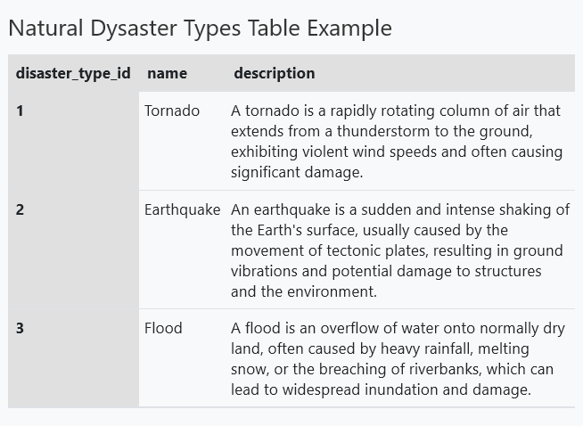
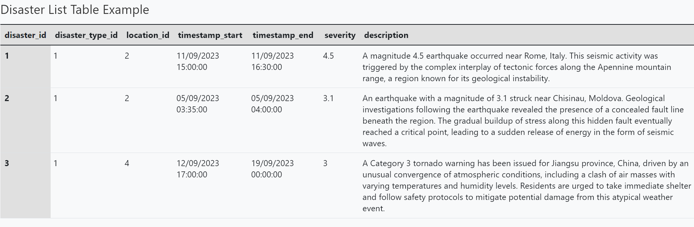

# Weather Data Microservice

## Application Suitability

The implementation of a weather data application through a microservice is necessary because it is important for the average user to get the weather data of a particular location in a fast way. A single instanced application at some point will not be able to handle a large amount of requests and will provide slower responses to the user. Another reason is the application in terms of features cand be broken down into different services where they can be maintained and updated separately. This will allow the application to be more scalable and flexible.

With the application being broken down into multiple services and maintaned separately, this will increase availability. In case of a failure in one of the services, the other service will still be available to the user.

There are multiple weather applications that use microservices. One example is OpenWeatherMap which provides to the user: weather data for any location on the globe, weather map and forecasts. It also has features where customers can get access through APIs to historical weather data, weather maps, road risk data, solar panel energy prediction data and many more.

## Service Boundaries

The application will be broken down into 2 main services: weather data and natural disaster data. The weather data service will be responsible for getting the weather data for a particular location. Weather Data service will also call the Natural Disaster Service to get the information about active alerts of natural disaster (For example tornado or flood warnings). The natural disaster data service will be responsible for getting the natural disaster data for a particular location.

## Technology Stack and Communication Patterns

Both services will be written in Go. The communication between the services will be done through REST APIs. The communication between the services and the database will be done through SQL queries. The gateway will be written in Python and will be responsible for routing the requests to the appropriate service.

## Data Management

As there are 2 main services in the application (weather data and natural disaster data), there will be 2 databases. The weather data and the natural disaster data will be stored in a relational database.

The database of the weather data will have the following tables:

- `location_table` - stores the list of the locations

- `current_weather_table` - stores the current weather data for each location

- `forecast_weather_table` - stores the forecast weather data for each location

The database of the natural disaster data will have the following tables:

- `location_table` - stores the list of the locations which will be a copy of the location table from the weather data database
- `disaster_type_table` - stores the list of the disaster types

- `disaster_list_table` - stores the disaster data for each location

**<!> ADD INFORMATION ABOUT ENDPOINTS <!>**

## Deployment and Scaling

Each service will be deployed in a separate container where they will have a dockerfile with the necessary instructions to build the image. Docker compose will be used to deploy the application where it will create the containers and the network between them.
